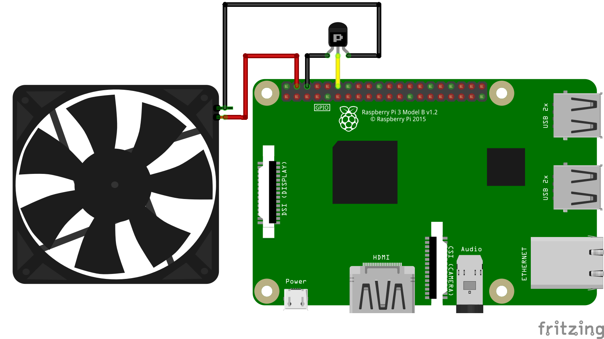

raspberry-pi-pid-pwm-fan
===
A Python script to regulate Raspberry Pi CPU temperature using PID tuned PWM fan.

## Hardware

Fritzing breadboard connection:



## Required Python Packages

Update Linux packages:
```
sudo apt-get update
```

Install Python 3 if not available:
```
sudo apt-get install python3.6
```

Install gpiozero package
```
sudo apt install python3-gpiozero
```

## Local Test

You can test if the Python script works by running:
```
python3 pwm_fan.py
```

## Copy Files

### Copy pwm_fan.py Python Script

```
sudo cp pwm_fan.py /usr/local/bin/pwm_fan.py
sudo chmod +x pwm_fan.py
```

### Copy pwm_fan Shell Script

```
sudo cp pwm_fan /etc/init.d/pwm_fan
sudo chmod +x pwm_fan
```

### Run update-rc

```
sudo update-rc.d pwm_fan defaults
```

### Verify

```
/etc/init.d/pwm_fan start
```

If you see error like ```-bash: /etc/init.d/pwm_fan: /bin/sh^M: bad interpreter:
No such file or directory```, it means the bash file format is incorrect.

To fix this:
```
vi /etc/init.d/pwm_fan
```
then type ```:set ff=unix```, then save with ```wq!```.

### Reboot

```
sudo reboot
```
